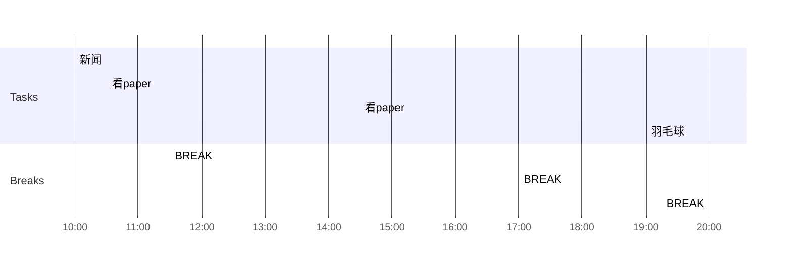

## Info
***
| Date        | Weather |
| ----------- | ------- |
| 2023-02-16-星期四 | 上海6~10℃晴转多云🔆        |

## Daily Target 
***

- [b] 💤早睡   12:00
- [b] 🌅早起    08:30
- [b] 🎵吉他    30min
- [b] 😴午觉    30min
- [b] 🏃‍♀️运动    30min
- [?] 🚫甜食    24h
- [b] 📖阅读    30min
- [?] 🔤单词    20min  

## Day Planner

- [ ] 10:00 新闻
- [ ] 10:30 看paper
- [ ] 11:30 BREAK
- [ ] 14:30 看paper
- [ ] 17:00 BREAK
- [ ] 19:00 羽毛球
- [ ] 20:00 BREAK

##  Journal
***
天气超好的一天

早上练了一会吉他
晚上要去虹训打球

一早上徐晗跟我说刘睿智删掉了官宣的pyq
我看了一下彭丽媛也删了他们前几天吃饭的pyq
应该是分手了吧。。

晚上去虹训打了球
栗子组的局
虽然没怎么打进行，因为绝大部分时间都是和另外三个女生打女双
所以失误比较多杀球比较少

但还是把腿拉去了。。

真是菜啊。。

得歇个几天，现在右腿右手都废了

