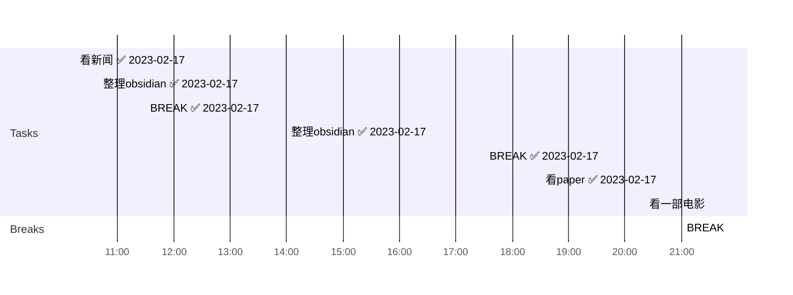

## Info
***
| Date        | Weather                             |
| ----------- | ----------------------------------- |
| 2023-02-17-星期五 | 上海7~12℃多云☁️ | 


```ad-cite
书名：《平凡的世界》第一部

作者：路遥

摘抄：人活着，这种亲人之间的感情是多么重要，即使人的一生充满了坎坷和艰辛，只要有这种感情存在，也会感到一种温暖的慰藉。假如没有这种感情，我们活在这世界上会有多么悲哀啊……
——少安第一次进城找润叶，两个一起走在街上时

```


## Daily Target 
***
- [b] 💤早睡   12:00
- [b] 🌅早起    08:30
- [b] 🎵吉他    30min
- [b] 😴午觉    30min
- [?] 🏃‍♀️运动    30min  
- [?] 🚫甜食    24h
- [b] 📖阅读    30min
- [?] 🔤单词    20min   


## Day Planner


- [x] 10:15 看新闻 ✅ 2023-02-17
- [x] 10:40 整理obsidian ✅ 2023-02-17
- [x] 11:30 BREAK ✅ 2023-02-17
- [x] 14:00 整理obsidian ✅ 2023-02-17
- [x] 17:30 BREAK ✅ 2023-02-17
- [x] 18:30 看paper ✅ 2023-02-17
- [x] 21:00 BREAK
- [ ] 21:30 看一部电影


##  Journal
***
今天差不多把ob日记模板整理好了，学会了dataview和templater（学会了一丢丢）
以后就方便干净多了
这周末事情有点多，又要帮叶萍姐姐搬家，还要考货币银行学
还约了一场周日海远的球（没办法货币银行学一考周日早上没时间打球了

晚上和yxw去吃了小黑街
她骑着小电驴带我去
感觉超级幸福
跟她讲了我目前为止复杂的感情线
讲了陈文翰讲了付旭
（不过也吃了好多

今天晚上早点走
先去跑个步再去寝室


- 发的时刻了
	- 艰苦奋斗是
	- 附件是快乐的
		- JFK的历史#diary