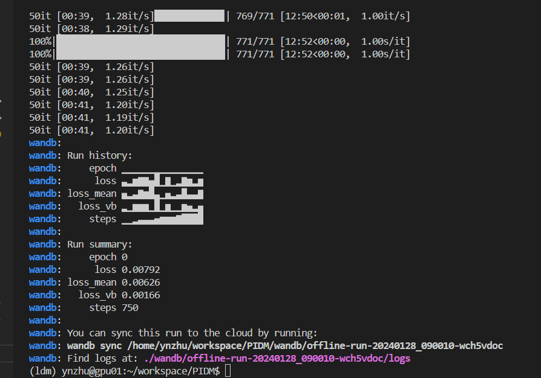
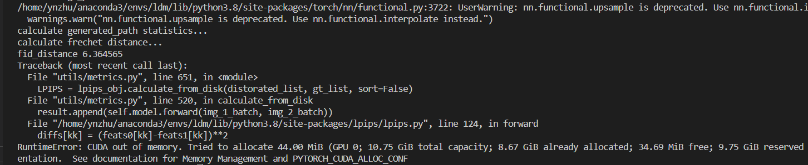
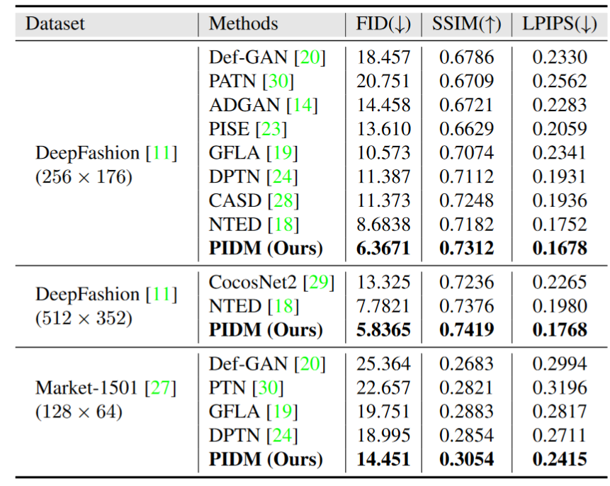

# 实验日志

## 2024-01-25 20:42:16 
- [x] 安装PIDM环境
gpu01
```python
python: 3.8.5
env_name:ldm
print(torch.version.cuda) #11.3
print(torch.__version__) #1.12.0
print(torch.cuda.device_count()) #8

```


## 2024-01-25 18:58:46 
- [x] prepare data

```bash
python data/prepare_data.py --root ./dataset/deepfashion --out ./dataset/deepfashion
```


- [x] inference
`python inference.py`

1. 报错：pydantic
解决：装低版本的pydantic

==todo【存在的问题】==
用非人形的照片：效果很差？


## train


### 2024-01-26 15:09:07

- [x] 第一次训练

- [ ] 分布式

**问题：报错【尚未解决】**
**更新：已解决【mogen更换为ldm】**
```bash
CUDA_VISIBLE_DEVICES='0,1' \
python -m torch.distributed.launch --nproc_per_node=2 --master_port 48949 train_initial.py \
--dataset_path "./dataset/deepfashion" --batch_size=16 --exp_name "pidm_deepfashion" \
--epoch_nums=5
```


- [x] 单卡非分布式

```bash
CUDA_VISIBLE_DEVICES='0,1,2,3' \
python train.py \
--dataset_path "./dataset/deepfashion" --batch_size 2 --exp_name "pidm_deepfashion"
```

**耗时：**

训练一个epoch，1.3s/it, 9254it/epoch
1.3*9254/3600 = 3.3h/epoch
save_checkpoints_every_iters = 2000
（但是中断了）


### 2024-01-27 22:37:11

- [x] 完成onnx模型结构的导出
于train_singlegpu.py中，添加了导出onnx模型的代码


### 2024-01-28 16:30:14

- [x] 冻结所有参数，成功用8块gpu跑模型
训练：(37016it/8gpu)=4627it/epoch * 300epoch * 
验证：4627it/epoch


**问题：**
Traceback (most recent call last):
  File "train_initial.py", line 336, in <module>
    main(settings = [args, DiffConf, DataConf], EXP_NAME = args.exp_name)
  File "train_initial.py", line 290, in main
    train(
  File "train_initial.py", line 107, in train
    for batch in tqdm(loader):
  File "/home/ynzhu/anaconda3/envs/ldm/lib/python3.8/site-packages/tqdm/std.py", line 1180, in __iter__
    for obj in iterable:
  File "/home/ynzhu/anaconda3/envs/ldm/lib/python3.8/site-packages/torch/utils/data/dataloader.py", line 652, in __next__
    data = self._next_data()
  File "/home/ynzhu/anaconda3/envs/ldm/lib/python3.8/site-packages/torch/utils/data/dataloader.py", line 1347, in _next_data
    return self._process_data(data)
  File "/home/ynzhu/anaconda3/envs/ldm/lib/python3.8/site-packages/torch/utils/data/dataloader.py", line 1373, in _process_data
    data.reraise()
  File "/home/ynzhu/anaconda3/envs/ldm/lib/python3.8/site-packages/torch/_utils.py", line 461, in reraise
    raise exception
TypeError: Caught TypeError in DataLoader worker process 0.
Original Traceback (most recent call last):
  File "/home/ynzhu/anaconda3/envs/ldm/lib/python3.8/site-packages/torch/utils/data/_utils/worker.py", line 302, in _worker_loop
    data = fetcher.fetch(index)
  File "/home/ynzhu/anaconda3/envs/ldm/lib/python3.8/site-packages/torch/utils/data/_utils/fetch.py", line 49, in fetch
    data = [self.dataset[idx] for idx in possibly_batched_index]
  File "/home/ynzhu/anaconda3/envs/ldm/lib/python3.8/site-packages/torch/utils/data/_utils/fetch.py", line 49, in <listcomp>
    data = [self.dataset[idx] for idx in possibly_batched_index]
  File "/home/ynzhu/workspace/PIDM/data/fashion_data.py", line 111, in __getitem__
    target_image_tensor = F.hflip(target_image_tensor)
  File "/home/ynzhu/anaconda3/envs/ldm/lib/python3.8/site-packages/torchvision/transforms/functional.py", line 405, in hflip
    raise TypeError('img should be PIL Image. Got {}'.format(type(img)))
TypeError: img should be PIL Image. Got <class 'torch.Tensor'>

**解决：**
在data/fashion_data.py中，将target_image_tensor = F.hflip(target_image_tensor)注释掉
重写：target_image_tensor = torch.flip(target_image_tensor, dims=[2])


## 2024-01-28 16:35:12

==todo【需要查看】==
- [x] 更改：tqdm中的nclos为70
- [x] epoch结束之后，是否会计算loss？
wandb: Run summary:
wandb:     epoch 0
wandb:      loss 0.00792
wandb: loss_mean 0.00626
wandb:   loss_vb 0.00166
wandb:     steps 750


==todo==
等到数据集准备好之后，计算FID等指标
fid_distance 6.364565  # 原文：6.3671






## 2024-01-28 23:11:02

生成视频帧
`python experiment/video2image.py  --videoPath=target_dance --svPath=target_dance`


## 结果


## 增加clip的loss


![[Pasted image 20240204224831.png]]


![[Pasted image 20240205000322.png]]
![[Pasted image 20240205000505.png]]


![[Pasted image 20240205001834.png]]


Total number of parameters:  191920774
Total number of trainable parameters:  0


Total number of parameters:  191,920,774
Total number of trainable parameters:  73,000,832


显存占用=模型显存(参数)+batch_size×每个样本显存(输出和梯度动量)

==增加了AFF注意力==
Total number of parameters:  192,675,430
Total number of trainable parameters:  12,319,712

模型显存：
显存占用：192344128×4/1024/1024=800.74MB～528MB（共有138344128个参数，每个都是float32类型的，即一个占用32位=4bytes）


遗留问题
![[Pasted image 20240205010455.png]]

OSError: We couldn't connect to 'https://huggingface.co' to load this model, couldn't find it in the cached files and it looks like openai/clip-vit-base-patch32 is not the path to a directory containing a config.json file.
Checkout your internet connection or see how to run the library in offline mode at 'https://huggingface.co/docs/transformers/installation#offline-mode'.
WARNING:torch.distributed.elastic.multiprocessing.api:Sending process 97793 closing signal SIGTERM
ERROR:torch.distributed.elastic.multiprocessing.api:failed (exitcode: 1) local_rank: 1 (pid: 97794) of binary: /home/ynzhu/anaconda3/envs/ldm/bin/python

解决方案


[Fetching Title#4p7x](https://blog.csdn.net/weixin_42209440/article/details/129999962)


` CUDA_VISIBLE_DEVICES='1,2,3' torchrun  --nproc_per_node=3 --master_port 48949 train_initial.py --dataset_path "./dataset/deepfashion" --batch_size=16 --exp_name "add_face_and_cloth" --epoch_nums=100`


![[Pasted image 20240208014511.png]]


TODO：
cloth和face的损失函数还没完成


![[Pasted image 20240208145241.png]]


![[Pasted image 20240208173417.png]]


Total number of parameters:  198,461,030
Total number of trainable parameters:  26,492,896


![[Pasted image 20240211115225.png]]


![[Pasted image 20240211213454.png]]


![[Pasted image 20240214014828.png]]


Total number of parameters:  198461030
Total number of trainable parameters:  0

Total number of parameters:  198461030
Total number of trainable parameters:  185476736


![[Pasted image 20240217114254.png]]


==最终参数量==

Total number of parameters:  271065647
Total number of trainable parameters:  148745519

![[Pasted image 20240217150800.png]]


![[Pasted image 20240218180014.png]]

![[Pasted image 20240218215906.png]]


== final==
Total number of parameters:  257154625
Total number of trainable parameters:  153638278
![[Pasted image 20240221225627.png]]

## 生成自己的结果 图片文件夹

CUDA_VISIBLE_DEVICES='1,2,3' torchrun  --nproc_per_node=3 gen.py --dataset_path "./dataset/deepfashion" --batch_size=2 --exp_name "add_parnet" 


CUDA_VISIBLE_DEVICES='1' torchrun  --nproc_per_node=1 --master_port=48699 gen_exp_for_mask.py --dataset_path "./dataset/deepfashion" --batch_size=2 --exp_name "add_parnet" 


## 结果记录
0. 官方结果
   fid_distance 6.364565  # 原文：6.3671
1. 
改进：
	1. 增加PISE的特征
	2. 对attention map做 mask相乘
	3. self attention guidance：250，1.01，3
结果：

FID: 7.001187829634347
LPIPS: tensor(0.1973)
SSIM: {'psnr': [15.00132], 'psnr_variance': [6.867725], 'ssim': [0.635145], 'ssim_variance': [0.017468], 'ssim_256': [0.701805], 'ssim_256_variance': [0.009864], 'mae': [0.090236], 'mae_variance': [0.002234], 'l1': [0.126536], 'l1_variance': [0.003021]}