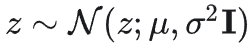

# DPM - 扩散概率模型

## 0. 概率论相关知识

1. 高斯分布

1. 贝叶斯分布
前向概率和后验概率，p(θ）是参数的概率分布，p(x)是观测数据的边际概率分布，p(x|θ)是后验分布。
ps：**边际概率分布**是指在联合概率分布中，针对某一个或某几个随机变量，将其他随机变量积分或求和得到的概率分布函数。简而言之，边际概率分布就是从联合概率分布中抽取出一个或几个随机变量的概率分布。
    
    
    
2. 联合概率分布
联合概率分布简称联合分布，是两个及以上随机变量组成的随机向量的概率分布。根据随机变量的不同，联合概率分布的表示形式也不同。对于离散型随机变量，联合概率分布可以以列表的形式表示，也可以以函数的形式表示；对于连续型随机变量，联合概率分布通过一非负函数的积分表示。
    
    
    
    
    

## 1. DPM基本原理

### 1.1 前向

上述公式可以通过**重参数技巧**来采样得到xt：是为了解决随机采样样本这一过程无法求导的问题。

下面这张图里，两个高斯分布相加中，两个方差相加。因为方差是平方，所以需要平方和相加，再开方。

1. 为什么要有系数βt
（可以理解为，在上一步的基础上，逐渐削弱一定比例）
    
    
    
2. 为什么要有根号
（不是很理解了。。）
    
    
    
3. αt的值是否固定
    
    
    

### 1.2 逆向

### 1.3 目标函数

上述px0是边际概率的求法，用到了—边际概率px0=联合概率密度函数对其他所有变量的积分。除了x0意外的x1:T称为隐变量（变成了一个典型的含有隐变量模型的估计问题），隐变量的存在（需要边际化消除）导致 对数似然函数存在了积分操作，这导致对数函数无法分解成简单的形式， 进而难以求解其梯度，无法直接极大化。 这时可以利用 Jensen 不等式，得到对数似然函数的一个下界函数（ELBO）， 当满足一定条件时，极大化这个下界函数和极大化对数似然是等价的。

下面公式的第一项用到了詹森不等式，因为对数函数是凹函数：

分别分析三项

- **reconstruction term**
    
    
    
- **prior matching term**
    
    
    
- **denoising matching term
q是真实的高斯分布，**通过推导可以进行一定变形：

总之：最后的结果是同样还是满足一个高斯分布。其中均值和方差上图已经标志出。

我们的目标——参数化模型分布需要尽可能地接近q，所以pθ也需要是一个高斯分布。

**最终的目标函数**

### 1.4 采样过程

也即图片生成过程。 

### 1.5 不足

## 2. DDPM

前言：与DPM的预测原始x0不同，DDPM预测噪声——降低学习难度，提升效果。

训练过程伪代码：

每次迭代：

疑问：

- 采样的初始数据来自数据集吗？
    
    
    
- 怎么转换分布
- 每次迭代的加噪步数是随机的吗
- αt怎么决定的
- t步加的噪声的ε都是相同的吗

采样过程伪代码：

## 3. Score-based DDPM

**前提知识 - Tweedie 公式（Tweedie’s Formula）**

在统计学中，经常需要根据观测样本估计一个概率分布的未知参数，估计算法有很多，比如最大似然估计、贝叶斯估计等等。 Tweedie 公式是一种估计指数族分布均值参数的方法，如果你不知道什么是指数族，可以查看本博客中广义线性模型的内容。 高斯分布就是指数族分布中的一种，所以可以 Tweedie 公式估计高斯分布的均值参数。 这里省略 Tweedie 公式的证明过程，只关注怎么使用 Tweedie 公式。

正向的扩散过程，均值可以重新写成：

可以用xt的分数来重新表示x0：

正向扩散过程的均值可以用这个分数来重新推导：

按照这个形式可以得到，预测的均值μθ：

## 4. 总结：DPM三种等价表示

**为什么会出现三种表示？**

**问题明确：**

1. DPM - 直接预测初始样本x0
均值μ第一种表达式：
    
    
    
    改写：
    
    
    
    学习x0
    
2. DDPM - 预测噪声ε
均值μ第二种表达式：
    
    
    
    
    
    相比直接学习初始样本x0，每一步学习噪声简单了许多，模型的效果提升很大。
    
3. Score-based DDPM - 预测分数sθ
均值μ的第三种表达式：
    
    
    
    
    
    此时模型学习预测的是分数（梯度）。相比学习噪声，学习分数有个好处，它可以令我在逆过程采样图片时采用基于分数的采样算法， **而基于分数的采样算法种类很多，这极大的增加了算法的灵活性。**
    

## 5. IDDPM

****改进降噪扩散概率模型（Improved Denoising Diffusion Probabilistic Models,IDDPM）：****

- 学习方差：之前的方差都视为常数
- 线性的schedule 改成余弦schedule